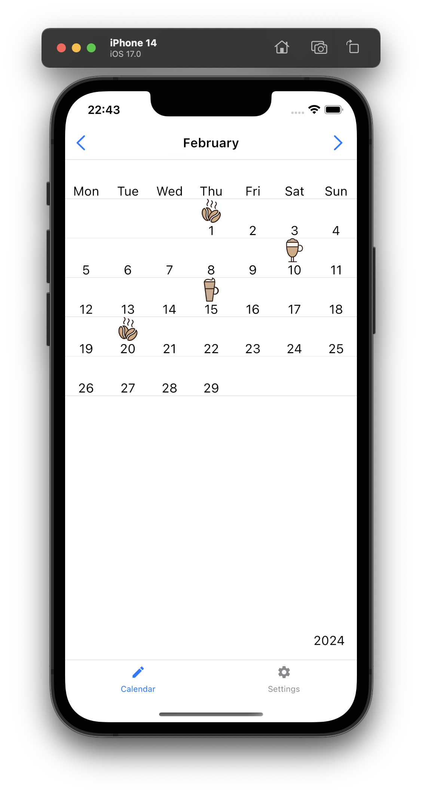
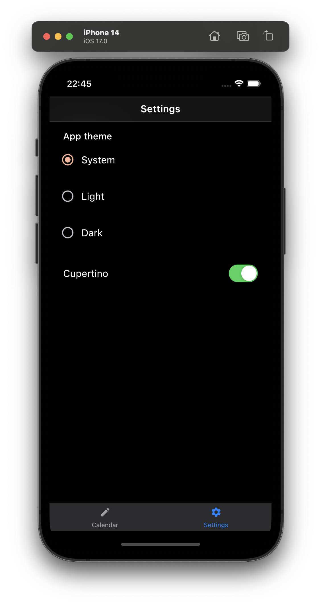
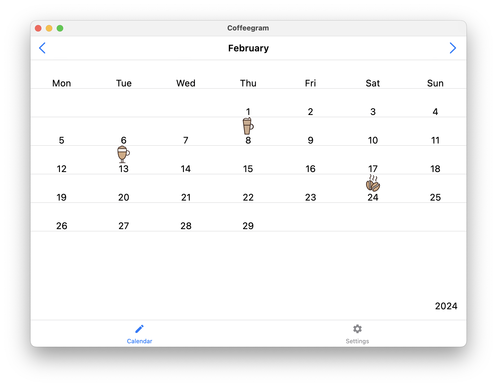
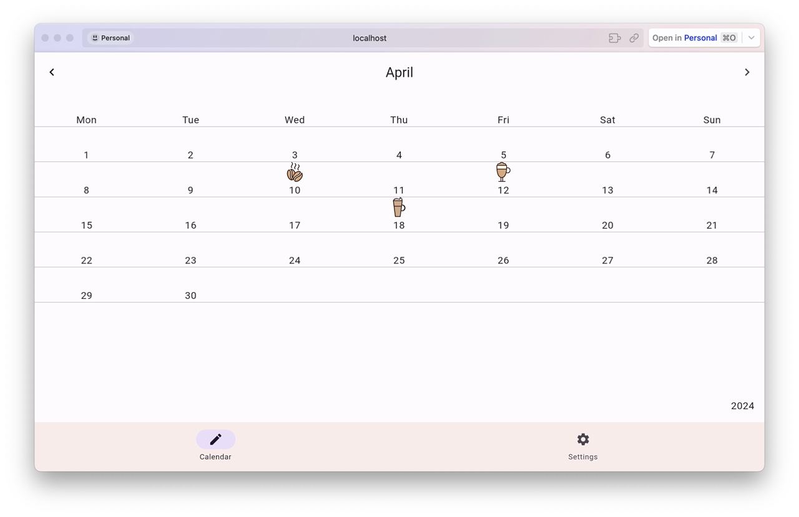

# Coffeegram
## Android & Multiplatform Compose based project #KMP

 
## Android app in Jetpack Compose and MVI

- Animated splash for Android 12
- [Android 13 Monochrome icon](docs-monochrome/MONOCHROME-ICON.md)

- Material3 Dynamic(Harmonized, following device's theme)/Day/Night themes (switch enabled)

- Glance AppWidgets

- Compose for Wearable

- Jetpack Datastore

- Room Multiplatform as an database

 

---
## Multiplatform Compose
Android + Desktop + iOS + [WASM](https://coffegram.beriukhov.tech/) multiplatform app using [Compose Multiplatform](https://github.com/JetBrains/compose-jb) together with StateFlow and MVI

Native iOS look & feel by [Compose Cupertino](https://github.com/alexzhirkevich/compose-cupertino/tree/master)

## Run on Desktop jvm
`./gradlew run`

## Run on Desktop - Hot Reload!
`./gradlew runHot`

## Run on iOS
[Using KMP plugin](https://kotlinlang.org/docs/multiplatform-plugin-releases.html)

---

# Next Steps
- More SwiftUI & UiKit integration samples 
- Compose Multiplatform + Native UI integration into iOS
- Compose optimisations

## More about initial app creation:

[Medium EN](https://proandroiddev.com/change-my-mind-or-android-development-transformation-to-jetpack-compose-coroutines-e719a342cc52)

[Habr RU](https://habr.com/ru/company/kaspersky/blog/513364/)

[Youtube (AppsFest) RU](https://youtu.be/CuCV-SGUuCQ/)
